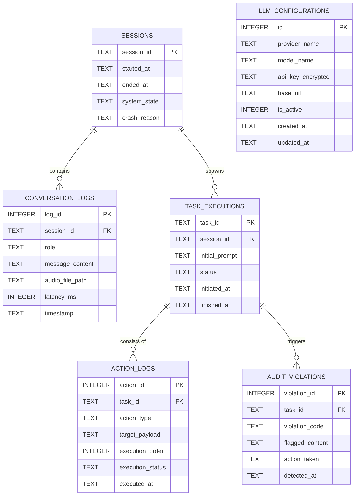

# Entity Relationship Diagram (ERD) & Database Specification

**Project Name:** J.A.R.V.I.S. (Autonomous Desktop Voice Agent)  
**Document Version:** 1.0.0  
**Storage Engine:** SQLite 3 (WAL Mode Enabled)  
**Database File:** `jarvis_memory.db`  

---

## 1. Executive Summary & Design Principles

To support real-time context preservation, zero-corruption guarantees during abrupt hardware shutdowns, multi-provider LLM settings, and security audits, the persistence layer is modeled with the following core architectural rules:

1. **Write-Ahead Logging (WAL):** Ensures concurrent read and write operations without database locking issues, resilient against power outages.
2. **Crash Recovery & Rehydration:** Every user voice prompt, system response, and task execution state is committed in ACID transactions.
3. **Audit & Safety Boundary:** Security violations (PII detection, blocked system operations) are committed immediately into an audit table before killing dangerous tasks.
4. **Decoupled Configuration:** API keys and provider models can be swapped dynamically from the JavaFX UI without altering historical logs.

---

## 2. Conceptual Entity Relationship Diagram (Mermaid)



---

## 3. Data Dictionary & Table Definitions

### 3.1 Table: `llm_configurations`
Stores connection profiles for multiple LLM providers (e.g., OpenAI, Anthropic, Gemini, Ollama, vLLM).

| Field Name | Type | Constraints | Description |
| :--- | :--- | :--- | :--- |
| `id` | INTEGER | PRIMARY KEY AUTOINCREMENT | Unique configuration ID |
| `provider_name` | TEXT | NOT NULL | Provider name (`openai`, `gemini`, `ollama`, etc.) |
| `model_name` | TEXT | NOT NULL | Specific model tag (`gpt-4o`, `gemini-1.5-pro`, `llama3`) |
| `api_key_encrypted` | TEXT | NULLABLE | Locally encrypted secret key (symmetric key) |
| `base_url` | TEXT | NULLABLE | Custom endpoint URL for local/self-hosted instances |
| `is_active` | INTEGER | DEFAULT 0 CHECK (is_active IN (0, 1)) | Active model flag (1 = Active, 0 = Inactive) |
| `created_at` | DATETIME | DEFAULT CURRENT_TIMESTAMP | Timestamp of creation |
| `updated_at` | DATETIME | DEFAULT CURRENT_TIMESTAMP | Timestamp of last modification |

### 3.2 Table: `sessions`
Tracks the lifecycle of each application execution, allowing the system to determine if a shutdown was clean or caused by an unexpected crash.

| Field Name | Type | Constraints | Description |
| :--- | :--- | :--- | :--- |
| `session_id` | TEXT | PRIMARY KEY | UUIDv4 string identifying each program run |
| `started_at` | DATETIME | DEFAULT CURRENT_TIMESTAMP | Boot time of the application session |
| `ended_at` | DATETIME | NULLABLE | Clean shutdown timestamp |
| `system_state` | TEXT | DEFAULT 'ONLINE' | State (`ONLINE`, `SHUTDOWN`, `CRASHED`) |
| `crash_reason` | TEXT | NULLABLE | Stack trace or signal description if crashed |

### 3.3 Table: `conversation_logs`
Chronological speech and chat interactions between user and J.A.R.V.I.S., supporting seamless context recovery.

| Field Name | Type | Constraints | Description |
| :--- | :--- | :--- | :--- |
| `log_id` | INTEGER | PRIMARY KEY AUTOINCREMENT | Unique log entry identifier |
| `session_id` | TEXT | NOT NULL, FOREIGN KEY | References `sessions(session_id)` |
| `role` | TEXT | NOT NULL CHECK (role IN ('user', 'assistant', 'system')) | Author of the dialogue item |
| `message_content` | TEXT | NOT NULL | Raw transcribed text or spoken response |
| `audio_file_path` | TEXT | NULLABLE | Cached path for generated/recorded audio chunk |
| `latency_ms` | INTEGER | NULLABLE | Roundtrip latency in milliseconds |
| `timestamp` | DATETIME | DEFAULT CURRENT_TIMESTAMP | Message recorded timestamp |

### 3.4 Table: `task_executions`
Tracks high-level autonomous screen navigation, typing, and OS tasks instructed by the user.

| Field Name | Type | Constraints | Description |
| :--- | :--- | :--- | :--- |
| `task_id` | TEXT | PRIMARY KEY | UUIDv4 string for the task |
| `session_id` | TEXT | NOT NULL, FOREIGN KEY | References `sessions(session_id)` |
| `initial_prompt` | TEXT | NOT NULL | Original user command initiating the task |
| `status` | TEXT | DEFAULT 'PENDING' CHECK (status IN ('PENDING', 'RUNNING', 'COMPLETED', 'ABORTED', 'FAILED')) | Current workflow status |
| `initiated_at` | DATETIME | DEFAULT CURRENT_TIMESTAMP | Start timestamp |
| `finished_at` | DATETIME | NULLABLE | Completion or termination timestamp |

### 3.5 Table: `action_logs`
Fine-grained atomic operations executed by the OS controller (mouse movement, clicks, keystrokes, camera capture).

| Field Name | Type | Constraints | Description |
| :--- | :--- | :--- | :--- |
| `action_id` | INTEGER | PRIMARY KEY AUTOINCREMENT | Unique action identifier |
| `task_id` | TEXT | NOT NULL, FOREIGN KEY | References `task_executions(task_id)` |
| `action_type` | TEXT | NOT NULL | Operation type (`TYPE`, `CLICK`, `MOVE`, `KEY_PRESS`, `CAMERA_SNAPSHOT`) |
| `target_payload` | TEXT | NOT NULL | JSON string detailing coords `(x, y)` or sanitized typed content |
| `execution_order` | INTEGER | NOT NULL | Step index within the parent task |
| `execution_status`| TEXT | DEFAULT 'SUCCESS' CHECK (execution_status IN ('SUCCESS', 'SKIPPED', 'FAILED')) | Action status |
| `executed_at` | DATETIME | DEFAULT CURRENT_TIMESTAMP | Timestamp when action completed |

### 3.6 Table: `audit_violations`
Permanent audit trail of security infractions intercepted by the `SecurityGuardrail` module.

| Field Name | Type | Constraints | Description |
| :--- | :--- | :--- | :--- |
| `violation_id` | INTEGER | PRIMARY KEY AUTOINCREMENT | Unique violation log identifier |
| `task_id` | TEXT | NOT NULL, FOREIGN KEY | References `task_executions(task_id)` |
| `violation_code` | TEXT | NOT NULL | Code (`PII_EMAIL`, `PII_PASSWORD`, `PII_PHONE`, `FORBIDDEN_OS_COMMAND`) |
| `flagged_content`| TEXT | NOT NULL | Intercepted content or command |
| `action_taken` | TEXT | DEFAULT 'ABORT_TASK' | Remediation action (`ABORT_TASK`, `INPUT_BLOCKED`) |
| `detected_at` | DATETIME | DEFAULT CURRENT_TIMESTAMP | Timestamp of violation detection |

---

## 4. Production DDL Schema (SQLite with WAL & Pragmas)

```sql
-- SQLite Performance and Resilience Tuning
PRAGMA journal_mode = WAL;
PRAGMA synchronous = NORMAL;
PRAGMA foreign_keys = ON;
PRAGMA busy_timeout = 5000;

-- 1. Multi-LLM Configurations
CREATE TABLE IF NOT EXISTS llm_configurations (
    id INTEGER PRIMARY KEY AUTOINCREMENT,
    provider_name TEXT NOT NULL,
    model_name TEXT NOT NULL,
    api_key_encrypted TEXT,
    base_url TEXT,
    is_active INTEGER DEFAULT 0 CHECK (is_active IN (0, 1)),
    created_at DATETIME DEFAULT CURRENT_TIMESTAMP,
    updated_at DATETIME DEFAULT CURRENT_TIMESTAMP
);

-- 2. Sessions
CREATE TABLE IF NOT EXISTS sessions (
    session_id TEXT PRIMARY KEY,
    started_at DATETIME DEFAULT CURRENT_TIMESTAMP,
    ended_at DATETIME,
    system_state TEXT DEFAULT 'ONLINE',
    crash_reason TEXT
);

-- 3. Conversation Context Logs
CREATE TABLE IF NOT EXISTS conversation_logs (
    log_id INTEGER PRIMARY KEY AUTOINCREMENT,
    session_id TEXT NOT NULL,
    role TEXT NOT NULL CHECK (role IN ('user', 'assistant', 'system')),
    message_content TEXT NOT NULL,
    audio_file_path TEXT,
    latency_ms INTEGER,
    timestamp DATETIME DEFAULT CURRENT_TIMESTAMP,
    FOREIGN KEY (session_id) REFERENCES sessions (session_id) ON DELETE CASCADE
);

-- 4. Autonomous Task Executions
CREATE TABLE IF NOT EXISTS task_executions (
    task_id TEXT PRIMARY KEY,
    session_id TEXT NOT NULL,
    initial_prompt TEXT NOT NULL,
    status TEXT DEFAULT 'PENDING' CHECK (status IN ('PENDING', 'RUNNING', 'COMPLETED', 'ABORTED', 'FAILED')),
    initiated_at DATETIME DEFAULT CURRENT_TIMESTAMP,
    finished_at DATETIME,
    FOREIGN KEY (session_id) REFERENCES sessions (session_id) ON DELETE CASCADE
);

-- 5. Atomic OS Action Logs
CREATE TABLE IF NOT EXISTS action_logs (
    action_id INTEGER PRIMARY KEY AUTOINCREMENT,
    task_id TEXT NOT NULL,
    action_type TEXT NOT NULL,
    target_payload TEXT NOT NULL,
    execution_order INTEGER NOT NULL,
    execution_status TEXT DEFAULT 'SUCCESS' CHECK (execution_status IN ('SUCCESS', 'SKIPPED', 'FAILED')),
    executed_at DATETIME DEFAULT CURRENT_TIMESTAMP,
    FOREIGN KEY (task_id) REFERENCES task_executions (task_id) ON DELETE CASCADE
);

-- 6. Security Violations and Kill-Switch Audits
CREATE TABLE IF NOT EXISTS audit_violations (
    violation_id INTEGER PRIMARY KEY AUTOINCREMENT,
    task_id TEXT NOT NULL,
    violation_code TEXT NOT NULL,
    flagged_content TEXT NOT NULL,
    action_taken TEXT DEFAULT 'ABORT_TASK',
    detected_at DATETIME DEFAULT CURRENT_TIMESTAMP,
    FOREIGN KEY (task_id) REFERENCES task_executions (task_id) ON DELETE CASCADE
);

-- Indices for Fast Querying and Context Hydration
CREATE INDEX IF NOT EXISTS idx_active_llm ON llm_configurations (is_active);
CREATE INDEX IF NOT EXISTS idx_conv_session_time ON conversation_logs (session_id, timestamp);
CREATE INDEX IF NOT EXISTS idx_task_session_status ON task_executions (session_id, status);
CREATE INDEX IF NOT EXISTS idx_action_task_order ON action_logs (task_id, execution_order);
CREATE INDEX IF NOT EXISTS idx_audit_task ON audit_violations (task_id);
```